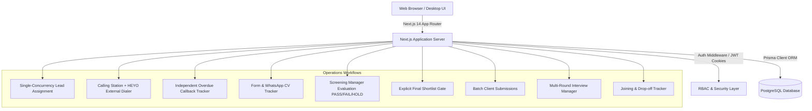

# Architecture Specification — Genius Consultancy CRM

## 1. System Overview

**Genius Consultancy CRM** is an internal recruitment operations platform designed specifically for the high-volume, multi-stage hiring workflows of Genius Consultancy. It is **strictly an internal tool** (single-tenant architecture) and excludes multi-tenant SaaS complexities, student management, or external client portals.

### High-Level Architecture Diagram



---

## 2. Technical Stack

| Layer | Technology | Rationale |
|---|---|---|
| **Framework** | Next.js 14 (App Router) + TypeScript | Modern server-side rendering, API route handlers, strict static type safety |
| **Styling & UI** | Tailwind CSS + Lucide Icons | Responsive enterprise dashboard layout, clean design system |
| **Database & ORM** | PostgreSQL + Prisma ORM (v5.22.0) | Relational integrity, ACID transactions, foreign keys, row-level locking support |
| **Authentication** | JWT (JSON Web Tokens) in `HttpOnly` Cookies | Secure stateless authentication resistant to XSS attacks |
| **Validation** | Zod (v3.23.8) | Runtime schema validation for all API inputs and bulk import payloads |
| **Excel Ingestion** | SheetJS (`xlsx` v0.18.5) | In-memory stream parsing of multi-sheet workbooks with scientific phone float normalization |
| **Date & Time** | `date-fns` & `date-fns-tz` | Consistent India Standard Time (`Asia/Kolkata` / UTC+05:30) date handling |

---

## 3. Core Architectural Principles

### 3.1 Strict Separation of Master Candidate vs. Transactional Application
- **`Candidate` (Master)**: Permanent profile representing a human candidate identified by normalized 10-digit mobile number (`normalizedPhone`). Contains static demographic details (full name, email, DOB, education, skills).
- **`Application` (Transaction)**: Represents a specific recruitment cycle for a Candidate applying for a specific `JobRequirement` at a `Company`. A candidate can have multiple historical applications over time, but only one active application per job.

### 3.2 Single Active Executive Concurrency Model
- When an application is assigned to an executive (`assignedExecutiveId`), **only that executive or an authorized manager/admin can log calls or modify the application**.
- Concurrency conflicts are prevented using transactional checks (`tx.application.findUnique` / pessimistic lock verification). If another user attempts to reassign or modify an active lead simultaneously, the transaction rolls back with a detailed error.

### 3.3 Explicit Screening & Final Shortlist Gates
- **Shortlisting** by an executive during calling triggers the Form & CV verification stage.
- Once Form & CV metadata are marked received, the application automatically enters `SCREENING_PENDING`.
- **Screening Evaluation**: The Screening Manager evaluates candidates against role criteria and records a checklist with `PASS`, `FAIL`, or `HOLD`.
- **Final Shortlist Gate**: Passing screening does **not** automatically dispatch the candidate to the client. An explicit manager action (`FINAL_SHORTLIST`) is required before creating a Client Submission batch.

### 3.4 External Dialer & WhatsApp Direct Integration (Zero Paid API Overhead)
- **Calling**: Dialing is performed via external HEYO hardware/app dialers. The CRM generates standardized `tel:+91...` URIs for instantaneous single-click dialing without VoIP or SIP PBX recurring costs.
- **WhatsApp**: Standardized templated links (`https://wa.me/91...?text=...`) allow executives to pre-fill customized introductory or document request messages directly in WhatsApp Web or WhatsApp Desktop.

### 3.5 Dynamic Location & Executive Reporting (No Hardcoded Metric Hallucinations)
- All conversion metrics are calculated dynamically using explicit database aggregate queries with exact numerators and denominators:
  - **Connection Rate** = $\frac{\text{Connected Calls}}{\text{Total Calling Attempts}} \times 100$
  - **Interest Rate** = $\frac{\text{Interested Calls}}{\text{Connected Calls}} \times 100$
  - **Screening Pass Rate** = $\frac{\text{Screening Passed}}{\text{Forms Received}} \times 100$
  - **Selection Rate** = $\frac{\text{Selected}}{\text{Interviews Conducted}} \times 100$

---

## 4. Directory Structure

```
├── prisma/
│   ├── schema.prisma              # PostgreSQL production schema
│   ├── schema.sqlite.prisma       # SQLite local testing schema
│   ├── seed.ts                    # Production bootstrap data seeder
│   └── migrations/                # Database migration scripts
├── src/
│   ├── app/                       # Next.js App Router
│   │   ├── api/                   # RESTful API Route Handlers
│   │   │   ├── auth/              # Login, Logout, Session Me
│   │   │   ├── applications/      # Assignment, Stages, History, Joining
│   │   │   ├── calling/           # Log Calls, Dialer hooks
│   │   │   ├── callbacks/         # Callbacks & Overdue status
│   │   │   ├── screenings/        # Screening checklist & evaluation
│   │   │   ├── submissions/       # Client batch submissions
│   │   │   ├── interviews/        # Multi-round interviews & outcomes
│   │   │   ├── reports/           # Real-time metrics & Location tracker
│   │   │   ├── imports/           # Excel preview & reconciliation commit
│   │   │   ├── quality/           # 1-5 Quality reviews
│   │   │   ├── audit/             # Immutable audit log queries
│   │   │   └── users/             # User management & presence tracking
│   │   ├── calling/               # Executive Calling Station page
│   │   ├── callbacks/             # Callbacks tracker page
│   │   ├── screening/             # Screening Manager evaluation page
│   │   ├── submissions/           # Client submissions & interviews page
│   │   ├── candidates/            # Candidate Master directory
│   │   ├── applications/          # Applications master grid
│   │   ├── companies/             # Company & Client management
│   │   ├── jobs/                  # Job requirements management
│   │   ├── reports/               # Executive & Location analytics
│   │   ├── quality/               # QA reviews & scoring page
│   │   ├── import/                # Excel upload & preview station
│   │   ├── users/                 # RBAC User administration
│   │   └── audit/                 # Audit trail viewer
│   ├── components/                # Modular UI Components
│   │   ├── layout/                # Navbar, Sidebar, Presence indicator
│   │   └── common/                # Badges, Modals, StatCards, Tables
│   ├── context/                   # React AuthContext & Global state
│   └── server/                    # Server-side business logic
│       ├── constants/             # RBAC Permissions & Role matrix
│       ├── middleware/            # Auth, Permission & Role guards
│       ├── services/              # Core Domain Services (ACID Transactions)
│       │   ├── AssignmentService.ts
│       │   ├── CallingService.ts
│       │   ├── ScreeningService.ts
│       │   ├── SubmissionService.ts
│       │   ├── InterviewService.ts
│       │   ├── QualityService.ts
│       │   ├── ReportService.ts
│       │   ├── ImportService.ts
│       │   └── AuditService.ts
│       ├── utils/                 # Phone normalization, IST date, JWT
│       └── validators/            # Zod validation schemas
├── scripts/
│   ├── backup-db.ts               # Automated PostgreSQL backup script
│   └── restore-db.ts              # Database restore utility
├── test/
│   └── run_tests.ts               # Comprehensive 46-test automated suite
└── docs/                          # Architecture & Operations documentation
```
