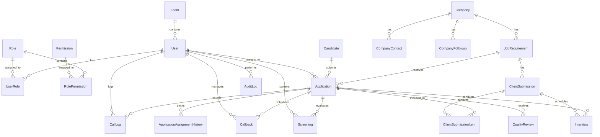

# Database Architecture & Schema Specification — Genius Consultancy CRM

## 1. Overview & Principles

The database layer is modeled in PostgreSQL using Prisma ORM. It enforces strict relational integrity, referential constraints, indexing for high-frequency queries, and explicit transactional boundaries.

### Key Tenets
1. **Separation of Concerns**: `Candidate` is the permanent entity (one per human); `Application` is the transactional lifecycle record (one per candidate-job cycle).
2. **Immutable Audit Trail**: The `audit_logs` table records every critical transition, assignment change, screening decision, and interview outcome with `oldValues` and `newValues` JSON snapshots.
3. **Indexed Query Optimization**: Normalized phone numbers, emails, foreign keys, assignment statuses, and overdue callback timestamps have compound indices.

---

## 2. Entity-Relationship Diagram

---

## 3. Core Models & Column Definitions

### 3.1 Users, Roles & Permissions
- **`users`**: Central authentication and user profile table. Tracks active session, `presenceStatus` (ONLINE, CALLING_ACTIVITY, AFTER_CALL_WORK, BREAK, OFFLINE), and last activity timestamp.
- **`roles`**: Standard operational roles (`SUPER_ADMIN`, `OPERATIONS_HEAD`, `SCREENING_MANAGER`, `BD_FINANCE_MANAGER`, `RECRUITMENT_EXECUTIVE`, `AUDITOR`).
- **`permissions`**: Granular permissions (e.g. `applications:assign`, `calling:log`, `screening:evaluate`, `shortlist:finalize`, `submissions:create`, `reports:view`).
- **`user_roles`**: Many-to-many junction enabling dual-hatting (e.g., Jyoti as `SCREENING_MANAGER` + `RECRUITMENT_EXECUTIVE`).

### 3.2 Companies & Job Requirements
- **`companies`**: Client companies offering hiring mandates.
- **`company_contacts`**: Point of Contact details (Name, Phone, Email, Designation).
- **`company_followups`**: Business development interaction history.
- **`job_requirements`**: Structured job postings with vacancies, salary ranges (`salaryMin`, `salaryMax`), required experience, educational criteria, and skills.

### 3.3 Candidate Master (Permanent)
- **`candidates`**:
  - `candidateCode`: Unique human-readable identifier (e.g. `CAN-2026-0001`).
  - `normalizedPhone`: Standard 10-digit Indian mobile number (`VARCHAR(10)`, indexed for instant deduplication).
  - `rawPhone`: Original input string prior to sanitization.
  - `fullName`, `email`, `gender`, `age`, `dateOfBirth`.
  - `currentLocation`, `permanentLocation`.
  - `education`, `experienceYears`, `skills`, `expectedSalary`.

### 3.4 Recruitment Application (Transaction)
- **`applications`**:
  - `applicationCode`: Unique code (e.g. `APP-2026-0001`).
  - `candidateId`, `jobId`, `companyId`.
  - `assignedExecutiveId`: Single active executive assignment.
  - `currentStage`: Finite State Machine enum (`NEW`, `ASSIGNED`, `CALLING`, `INTERESTED`, `SHORTLISTED`, `SCREENING_PENDING`, `SCREENING_PASSED`, `SCREENING_FAILED`, `SCREENING_HOLD`, `FINAL_SHORTLIST`, `SENT_TO_CLIENT`, `INTERVIEW_SCHEDULED`, `SELECTED`, `REJECTED`, `JOINING_PENDING`, `JOINED`, `NOT_JOINED`, `CLOSED`).
  - `formStatus`: (`PENDING`, `SENT`, `RECEIVED`).
  - `cvStatus`: (`CV_REQUIRED`, `CV_REQUESTED`, `CV_RECEIVED`, `VERIFIED`).
  - `readyForScreeningAt`, `finalShortlistedAt`, `finalShortlistedById`.

### 3.5 Calling & Callbacks
- **`call_logs`**:
  - `applicationId`, `candidateId`, `executiveId`.
  - `callOutcome`: (`CONNECTED`, `BUSY`, `RNR`, `SWITCHED_OFF`, `NOT_REACHABLE`, `CALL_BACK_REQUESTED`, `WRONG_NUMBER`, `DISCONNECTED`).
  - `candidateInterest`: (`INTERESTED`, `NOT_INTERESTED`, `CALL_BACK`, `SALARY_MISMATCH`, `LOCATION_MISMATCH`, `ALREADY_WORKING`).
  - `remarks`, `callbackRequired`, `callbackDateTime`.
- **`callbacks`**:
  - Independent tracking record created automatically when `callbackRequired = true`.
  - `status`: (`PENDING`, `COMPLETED`, `CANCELLED`).
  - Overdue status is derived dynamically in queries where `scheduledAt < now() AND status = 'PENDING'`.

### 3.6 Screening & Final Shortlist
- **`screenings`**:
  - `applicationId`, `screenerId`.
  - `screeningStatus`: (`PASS`, `FAIL`, `HOLD`).
  - `checklistScores`: JSON structured evaluation (e.g., communication, relevant experience, salary expectation alignment).
  - `remarks`, `nextAction`.

### 3.7 Client Submissions & Multi-Round Interviews
- **`client_submissions`**:
  - `batchCode`: Unique batch code (e.g. `SUB-2026-0001`).
  - `companyId`, `jobId`, `submittedById`, `sentAt`.
- **`client_submission_items`**: Junction linking applications included in the batch.
- **`interviews`**:
  - `applicationId`, `submissionId`.
  - `roundNumber`: 1, 2, 3...
  - `roundName`: e.g. "Technical Round 1", "HR Final Round".
  - `scheduledAt`, `mode` (`OFFLINE`, `ONLINE`, `TELEPHONIC`), `location`.
  - `status`: (`SCHEDULED`, `COMPLETED`, `CANCELLED`, `RESCHEDULED`, `NO_SHOW`).
  - `outcome`: (`PENDING`, `SELECTED_FOR_NEXT_ROUND`, `SELECTED`, `REJECTED`, `ON_HOLD`).

### 3.8 Quality Reviews & Audit Logs
- **`quality_reviews`**:
  - QA assessment of executive calling performance (`rating` 1–5, `communicationScore`, `jobExplanationScore`, `processAdherenceScore`, `remarks`).
- **`audit_logs`**:
  - `userId`, `action`, `entity`, `entityId`, `oldValues` (JSON), `newValues` (JSON), `ipAddress`, `userAgent`, `createdAt`.
