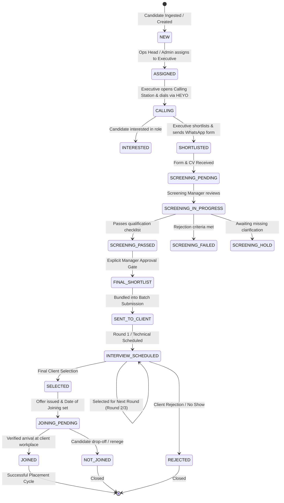

# Recruitment Operations Workflow & State Machine — Genius Consultancy CRM

## 1. End-to-End Recruitment Lifecycle

The operational recruitment lifecycle follows a strict state transition pipeline:

---

## 2. Operational Stage Transition Rules

### Stage 1: Ingestion & Lead Assignment
- **Ingestion**: Sourced via Excel import (`Telecalling Operation.xlsx`) or manual entry into `candidates` and `applications`. Initial stage: `NEW`.
- **Assignment**: Handled by `OPERATIONS_HEAD` or `SUPER_ADMIN`.
- **Concurrency Lock**: Once assigned, `assignedExecutiveId` is set. Other executives cannot modify the record. Reassignment is recorded in `application_assignment_history`.

### Stage 2: Calling & Dialer Hook (External HEYO)
- **Calling Station**: Executive clicks `tel:+91XXXXXXXXXX` (triggers local phone/HEYO hardware dialer) or `wa.me/91...` (opens WhatsApp Web/Desktop with templated text).
- **Outcomes**:
  - `CONNECTED` (Prompt for Interest: `INTERESTED`, `SHORTLISTED`, `NOT_INTERESTED`, `SALARY_MISMATCH`, `LOCATION_MISMATCH`).
  - `BUSY` / `RNR` / `SWITCHED_OFF` / `NOT_REACHABLE` / `CALL_BACK_REQUESTED`.
- **Callbacks**: If callback is requested, an independent `Callback` record is created with scheduled timestamp. If the scheduled time passes without completion, it is dynamically flagged `OVERDUE`.

### Stage 3: Shortlisting, Form & CV Verification
- If candidate is marked `SHORTLISTED`, executive sends Google Form / application link and requests CV via WhatsApp.
- When `formStatus = 'RECEIVED'` and `cvStatus = 'CV_RECEIVED'` (or `VERIFIED`), the system automatically promotes application stage to `SCREENING_PENDING`.

### Stage 4: Screening Manager Evaluation Gate
- **Role**: `SCREENING_MANAGER` (e.g. Jyoti) reviews candidate qualification checklist.
- **Outcomes**:
  - `PASS`: Moves to `SCREENING_PASSED`.
  - `FAIL`: Moves to `SCREENING_FAILED` (with recorded rejection reason).
  - `HOLD`: Moves to `SCREENING_HOLD` (with note on what information is needed).

### Stage 5: Explicit Final Shortlist Gate
- Passing screening does **not** automatically send the candidate to the client.
- The Screening Manager or Ops Head must explicitly approve the application via `/api/shortlists/finalize`, advancing stage to `FINAL_SHORTLIST`.

### Stage 6: Batch Client Submission
- Manager selects one or more `FINAL_SHORTLIST` candidates for a given Job and creates a `ClientSubmission` (e.g. `SUB-2026-0001`).
- All selected applications advance to `SENT_TO_CLIENT`.

### Stage 7: Multi-Round Interviews
- Interviews are scheduled with:
  - `roundNumber`: 1 (Round 1), 2 (Round 2), 3 (HR Final), etc.
  - `mode`: `OFFLINE` (with venue address) or `ONLINE` (with meeting link).
- **Outcomes**:
  - `SELECTED_FOR_NEXT_ROUND`: Automatically creates the next sequential interview round record.
  - `SELECTED`: Advances application to `SELECTED`.
  - `REJECTED`: Records rejection feedback and marks application `REJECTED`.
  - `NO_SHOW`: Records attendance failure.

### Stage 8: Joining & Verification
- Once selected, manager sets Date of Joining (`dateOfJoining`) and stage changes to `JOINING_PENDING`.
- On joining date, executive/manager verifies workplace reporting:
  - **Verified Arrival**: Stage transitions to `JOINED` (Audit event logged).
  - **Candidate Drop-off**: Stage transitions to `NOT_JOINED` (Drop-off reason captured).
